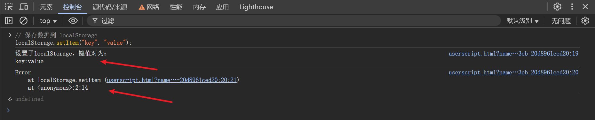

# 个人JS Hook脚本分享

本项目脚本配置教程视频：`https://www.bilibili.com/video/BV1rG9oYzEUH/`

## 必看说明

1. 以下所有hook脚本在油猴里的运行时期皆为**document-start**。
2. 以下所有脚本除hook_debugger下的脚本以外，我在重写方法时都没有为了它们重写toString方法以防止网站js检测方法是否被重写过。
3. 以下所有本人所写的脚本中如果包含`console.log(new Error().stack);`这句代码，全都可以改写为`debugger`，以方便使用时查看堆栈。
4. 当hook后依然不能实现功能，请自查油猴或其他插件加载的脚本是不是做了同样的操作，例如重写Function等等，个人建议使用时除不是自己写的脚本(指没有做要用的脚本同样动作的)都关闭。
5. hook_debugger\Hook_eval、hook_debugger\Hook_Function和Hook_CryptoJS文件夹下的脚本不再继续更新。

## 脚本目录

- <a href="#hook_table">hook_console/hook_table.js</a>
- <a href="#Forbidden_log">hook_console/Forbidden_log.js</a>
- <a href="#hook_localStorage">hook_window/hook_localStorage.js</a>
- <a href="#hook_sessionStorage">hook_window/hook_sessionStorage.js</a>
- <a href="#Hook_innerHTML">Hook_xss/Hook_innerHTML.js</a>
- <a href="#Hook_outerHTML">Hook_xss/Hook_outerHTML.js</a>
- <a href="#Hook_CryptoJS">Hook_CryptoJS/Hook_CryptoJS(未完成作).js</a>
- <a href="#Hook_fetch">Hook_fetch.js</a>
- <a href="#Fixed_window_size">实用小脚本/Fixed_window_size.js</a>
- <a href="#bypass_format_detection">实用小脚本/过格式化检测.js</a>
- <a href="#Hook_cookie v0.1">Hook_cookie/Hook_cookie v0.1.js</a>
- <a href="#Hook_cookie v0.2">Hook_cookie/Hook_cookie v0.2.js</a>
- <a href="#hook_clear">hook_console/hook_clear.js</a>
- <a href="#hook_log v0.1">hook_console/hook_log v0.1.js</a>
- <a href="#hook_log v0.2">hook_console/hook_log v0.2.js</a>
- <a href="#hook_close">hook_window/hook_close.js</a>
- <a href="#hook_history">hook_window/hook_history.js</a>
- <a href="#hook_JSON">hook_JSON.js</a>
- <a href="#Hook_xhr">Hook_xhr/Hook_xhr.js</a>
- <a href="#Hook_xhr(assign)">Hook_xhr/Hook_xhr(assign).js</a>
- <a href="#Bypass_Debugger">hook_debugger/Bypass_Debugger</a>
- <a href="#Hook_Function">hook_debugger/Hook_Function/Hook_Function.js</a>
- <a href="#Hook_eval">hook_debugger/Hook_eval</a>

## 脚本描述及注意事项

- <a id="hook_table" href="https://github.com/0xsdeo/Hook_JS/blob/main/hook_console/hook_table.js">hook_console/hook_table.js</a>

脚本描述：绕过js检测运行时间差来实现反调试。

- <a id="Forbidden_log" href="https://github.com/0xsdeo/Hook_JS/blob/main/hook_console/Forbidden_log.js">hook_console/Forbidden_log.js</a>

脚本描述：重写console.log为空函数，以此来阻止网站js打印内容。

- <a id="hook_localStorage" href="https://github.com/0xsdeo/Hook_JS/blob/main/hook_window/hook_localStorage.js">hook_window/hook_localStorage.js</a>

脚本描述：当js调用了localStorage某个方法时会打印出相对应的内容，并且会打印出调用了该方法的堆栈。

效果：
保存数据到localStorage：



从localStorage获取数据：


从localStorage删除保存的数据：


从localStorage删除所有保存的数据：


- <a id="hook_sessionStorage" href="https://github.com/0xsdeo/Hook_JS/blob/main/hook_window/hook_sessionStorage.js">hook_window/hook_sessionStorage.js</a>

脚本描述：当js调用了sessionStorage某个方法时会打印出相对应的内容，并且会打印出调用了该方法的堆栈。

效果同上。

- <a id="Hook_innerHTML" href="https://github.com/0xsdeo/Hook_JS/blob/main/Hook_xss/Hook_innerHTML.js">Hook_xss/Hook_innerHTML.js</a>

脚本描述：当js通过元素的innerHTML属性设置元素内容时就会打印出元素。

效果：


- <a id="Hook_outerHTML" href="https://github.com/0xsdeo/Hook_JS/blob/main/Hook_xss/Hook_outerHTML.js">Hook_xss/Hook_outerHTML.js</a>

脚本描述：当js通过元素的outerHTML属性设置元素内容时就会打印出设置的内容以及调用堆栈。

效果：


- <a id="Hook_CryptoJS" href="https://github.com/0xsdeo/Hook_JS/blob/main/Hook_CryptoJS/Hook_CryptoJS(%E6%9C%AA%E5%AE%8C%E6%88%90%E4%BD%9C).js">Hook_CryptoJS/Hook_CryptoJS(未完成作).js</a>

脚本描述：当调用了CryptoJS库中的某个加密/解密方法时会自动打印出加密或解密的明文或密文，并且会打印出调用了该方法的堆栈。

效果：


注意事项：本脚本为未完成作，算法不完整以及可能会有报错，但是我不会再继续对这个脚本进行完善补充，原因有以下两点：

1. CryptoJS是一个现成的实例对象，hook方法只能从它那儿改：

2. 有的网站在导入CryptoJS库时都会把CryptoJS对象名换成别的，所以我个人认为没有必要再去专门写一个脚本hook这个库。

当然了，如果有大牛想继续完成我未完成的部分，可以通过我的公众号联系我，我代表各位感谢您。

- <a id="Hook_fetch" href="https://github.com/0xsdeo/Hook_JS/blob/main/Hook_fetch.js">Hook_fetch.js</a>

脚本描述：当通过fetch请求时会打印出传进的参数以及堆栈信息。

效果：


- <a id="Fixed_window_size" href="https://github.com/0xsdeo/Hook_JS/blob/main/%E5%AE%9E%E7%94%A8%E5%B0%8F%E8%84%9A%E6%9C%AC/Fixed_window_size.js">实用小脚本/Fixed_window_size.js</a>

脚本描述：js获取浏览器高度(window.innerHeight)或宽度(window.innerWidth)时获取到的是脚本中设置的固定值，如果网站js尝试去设置高度和宽度值时会直接去设置固定值，并不会按照网站js设置的值去设置。

注意事项：该脚本设置的高度和宽度默认值是按照我浏览器未打开Devtools的值设置的，`window.innerHeight`：

`window.innerWidth`:

使用时可自行更改：


在打开Devtools的前提下未Hook和已Hook的效果图：


- <a id="bypass_format_detection" href="https://github.com/0xsdeo/Hook_JS/blob/main/%E5%AE%9E%E7%94%A8%E5%B0%8F%E8%84%9A%E6%9C%AC/%E8%BF%87%E6%A0%BC%E5%BC%8F%E5%8C%96%E6%A3%80%E6%B5%8B.js">实用小脚本/过格式化检测.js</a>

脚本描述：绕过js检测代码是否被格式化过。

注意事项：

1. **把本脚本的代码放到目标脚本的最上面即可。**
2. 本脚本为初版脚本，如有绕不过去的代码可联系我。

感谢`我真的不是蜘蛛`公众号号主提供的测试样本。

- <a id="Hook_cookie v0.1" href="https://github.com/0xsdeo/Hook_JS/blob/main/Hook_cookie/Hook_cookie%20v0.1.js">Hook_cookie/Hook_cookie v0.1.js</a>

脚本描述：当js设置cookie时就会打印其堆栈信息和设置的cookie。

注意事项：**当使用该脚本hook站点时，如果网站js尝试设置cookie就不会成功**，所以需要注意的是某些站点可能会校验cookie，但是js又不能成功设置cookie，就导致站点一直重定向反复设置cookie，此时就可以考虑使用`Hook_cookie v0.2`。

效果：


直接定位到设置cookie的位置。

详见：<a href="https://mp.weixin.qq.com/s/28q2Hd0ZLRyBRyRT_8JE0g">JS逆向系列12-深入Js Hook</a>

- <a id="Hook_cookie v0.2" href="https://github.com/0xsdeo/Hook_JS/blob/main/Hook_cookie/Hook_cookie%20v0.2.js">Hook_cookie/Hook_cookie v0.2.js</a>

脚本描述：当js设置cookie时就会打印其堆栈信息和设置的cookie。

注意事项：**当使用该脚本hook站点时，网站js可以成功设置cookie，不会再有v0.1脚本设置失败的情况**，例如：


效果同v0.1脚本。

- <a id="hook_clear" href="https://github.com/0xsdeo/Hook_JS/blob/main/hook_console/hook_clear.js">hook_console/hook_clear.js</a>

脚本描述：重写`console.clear`方法，以此来禁止js清除控制台数据。

详见：<a href="https://mp.weixin.qq.com/s/r-ZcP2knpmoVEK0y_26xBw">JS逆向系列10-反调试与反反调试</a>

- <a id="hook_log v0.1" href="https://github.com/0xsdeo/Hook_JS/blob/main/hook_console/hook_log%20v0.1.js">hook_console/hook_log v0.1.js</a>

脚本描述：通过冻结console对象来禁止js重写log方法。

注意事项：该脚本主要针对网站重写console.log方法时处在`非严格模式`下，因为如果网站js是在严格模式下重写的console.log方法，并且在冻结console对象的前提下就会导致报错，例如：


但是如果是非严格模式下就不会报错，例如以下案例：

如果是上文那种处于严格模式下重写的log方法，此时就可以考虑使用`hook_log v0.2脚本`。

详见：<a href="https://mp.weixin.qq.com/s/l6_m3x3TbKDma_eexxx-Zw">JS逆向系列13-反调试之console.log</a>

- <a id="hook_log v0.2" href="https://github.com/0xsdeo/Hook_JS/blob/main/hook_console/hook_log%20v0.2.js">hook_console/hook_log v0.2.js</a>

脚本描述：通过toString方法判断console.log方法是否被重写，以此来防止js重写log方法。

注意事项：

1. 当使用该脚本hook时，刷新或进入网站时尽量不要开着F12，最好是等几秒再打开F12，这样做主要是为了防止漏掉一些原本js log的内容(当然开着F12也是可以的)。
2. 该脚本主要是为了防止hook_log v0.1注意事项中提到的那种情况，例如我就拿v0.2脚本hook那个报异常的案例：

成功打印出内容并没有报错。
3. 脚本定义了一个waiting_time，这个变量主要是为了防止页面一直没加载完毕从而导致脚本的window.onload一直不会生效，这可能是由于页面的一些资源卡住等问题造成的，所以此时可以通过设置waiting_time等待时间，也就是等待页面加载地差不多的时候就进行判断js是否重写了log方法，**默认为3秒**。
4. 极端情况：如果网站js是处于严格模式下重写console.log方法，并且随后还冻结了console对象，那么我这个脚本做的操作就无济于事了，而且这个脚本还是处于严格模式下，所以可能还会报错，此时就可以考虑将代码的前几行，也就是被注释掉的部分打开：

在这段代码中我将`Object.freeze`重写了，我之所以注释掉是怕网站用这个方法做了什么操作，怕引起不必要的报错，如果遇到了上面的情况，就可以考虑打开这段代码。

我画了一张图供各位参考：


**注：这两个脚本一定不要混用！！！**

- <a id="hook_close" href="https://github.com/0xsdeo/Hook_JS/blob/main/hook_window/hook_close.js">hook_window/hook_close.js</a>

脚本描述：重写close方法，以此来避免网站反调试关闭当前页面。

详见：<a href="https://mp.weixin.qq.com/s/r-ZcP2knpmoVEK0y_26xBw">JS逆向系列10-反调试与反反调试</a>

- <a id="hook_history" href="https://github.com/0xsdeo/Hook_JS/blob/main/hook_window/hook_history.js">hook_window/hook_history.js</a>

脚本描述：重写go和back方法，以此来避免网站反调试返回上一页或某个特定历史页面。

详见：<a href="https://mp.weixin.qq.com/s/r-ZcP2knpmoVEK0y_26xBw">JS逆向系列10-反调试与反反调试</a>

- <a id="hook_JSON" href="https://github.com/0xsdeo/Hook_JS/blob/main/hook_JSON.js">hook_JSON.js</a>

脚本描述：重写parse和stringify方法，以此来获取调用这个方法所传入的内容以及堆栈信息。

效果：


详见：<a href="https://mp.weixin.qq.com/s/yBoy-jG3grI-t0EUIAQNJg">JS逆向系列09-Js Hook</a>

- <a id="Hook_xhr" href="https://github.com/0xsdeo/Hook_JS/blob/main/Hook_xhr/Hook_xhr.js">Hook_xhr/Hook_xhr.js</a>

脚本描述：当设置了请求头时就会打印堆栈信息和设置的请求头内容；发送请求前会打印出堆栈信息和请求信息。

效果：


注意事项：当打印的request内容为`[object Blob]`时，则表示请求内容为二进制流，例如：


- <a id="Hook_xhr(assign)" href="https://github.com/0xsdeo/Hook_JS/blob/main/Hook_xhr/Hook_xhr(assign).js">Hook_xhr/Hook_xhr(assign).js</a>

脚本描述：

1. 当设置了请求头时就会打印堆栈信息和设置的请求头内容；发送请求前会打印出堆栈信息和请求信息。
2. **本脚本是专门用来捕获指定请求头以及请求URL的hook_xhr脚本。**

注意事项：

1. 使用时将想捕获的请求头或请求URL放入到`assign_RequestHeader`或`assign_url`变量中即可。
2. 因为本脚本是专门提供捕获指定URL以及指定请求头的hook xhr脚本，所以用户如果没有指定请求头或指定请求URL`将不会打印任何内容`。
3. 本脚本可以不需要同时指定请求头或请求URL，如果单独设置了一个也会打印出包含了指定请求头或请求URL的内容。
4. 使用本脚本时如果也想继续抓取请求的内容，那么就需要单独设置一下捕获哪个请求URL，如果不设置是不会打印出请求的内容。

效果：


如对本脚本有更好的建议可以提交Issues或者联系我。

- <a id="Bypass_Debugger" href="https://github.com/0xsdeo/Hook_JS/tree/main/hook_debugger/Bypass_Debugger">hook_debugger/Bypass_Debugger</a>

该目录下的脚本可bypass：

new Function --> debugger

constructor --> debugger

eval --> debugger

也就是说大部分存在无限debugger的站点皆可bypass掉。

我又另开了一个仓库专门放这些脚本，详见：`https://github.com/0xsdeo/Bypass_Debugger`

注意事项：

1. 本脚本在油猴里的运行时期为`document-start`。

2. 如果发现hook后打开F12依然存在debugger：

- **建议开着F12在刷新一次。** 
- 请检查油猴或其他插件加载的脚本是不是做了同样的操作，例如重写Function等等，个人建议使用时除不是自己写的脚本(指没有做本脚本同样动作的)都关闭。

3. 我的这段Bypass Debugger脚本，目前已知的只有以下这两种情况不能被bypass掉：
```js
var dbg = function (){
    debugger;
}
setInterval(dbg,3000);
```


以及直接将debugger写在script当中的：


以上这两种设条件断点就能过(如果不知道怎么设置条件断点的可以去看一下我之前写的反调试与反反调试一文)，或者替换也行，不需要hook的，所以我就暂时没去管这个。

4. 如果hook后站点js出现异常，是因为eval的作用域问题导致的，此时可以考虑将chrome的`来自eval或控制台的匿名脚本`设置打开：


现在就能解决掉由eval和Function引起的无限debugger。但如果你不想忽略掉来自eval和Function的匿名脚本,可以考虑使用`Bypass_Debugger(备用)`，该脚本只会hook Function和Function.prototype.constructor，并不会影响到eval，所以如果目标网站是由eval引起的debugger就没办法了。

- <a id="Hook_Function" href="https://github.com/0xsdeo/Hook_JS/blob/main/hook_debugger/Hook_Function/Hook_Function.js">hook_debugger/Hook_Function/Hook_Function.js</a>

该脚本可bypass：

new Function --> debugger

constructor --> debugger

- <a id="Hook_eval" href="https://github.com/0xsdeo/Hook_JS/tree/main/hook_debugger/Hook_eval">hook_debugger/Hook_eval</a>

该目录下的脚本可bypass：

eval --> debugger

注意事项：如果发现hook后站点js出现异常，可以考虑使用备用脚本，也就是`Hook_eval(备用).js`。

注：这三个bypass debugger脚本我个人建议只使用`Bypass_Debugger`，极其不建议混用Hook_Function和Hook_eval这两个脚本，因为另外两个Hook_Function和Hook_eval这两个脚本的toString方法我是各自只针对它俩的，比如我在Hook_Function脚本里重写的toString方法就只写了Function：

Hook_eval亦是如此，所以要是两个一块用的话可能会出一些问题，有经验的师傅应该已经猜出来了，因为我这里直接重写的是Function原型上的toString方法，两个一块用的话后执行的就必定会覆盖掉先执行的，所以我这里建议只使用Bypass_Debugger这个脚本。

## Contact

如有bug或其他问题可提交issues，或者关注公众号Spade sec联系我。

本开源项目微信交流群：


## Star History

[](https://star-history.com/#0xsdeo/Hook_JS&Date)